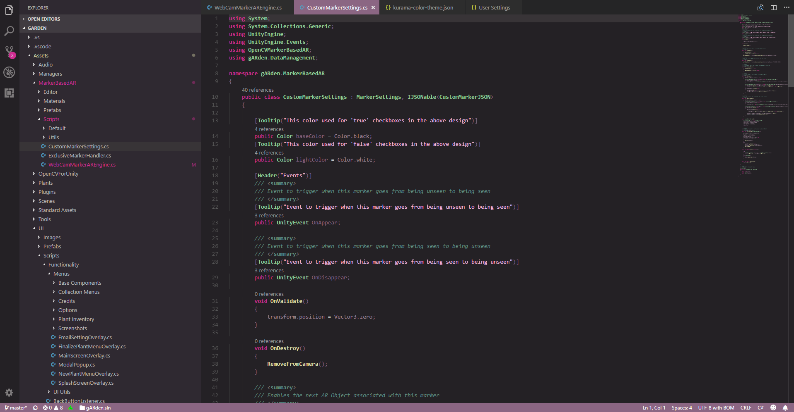

# kurama 🌹

floral-inspired dark theme for [VS Code](https://code.visualstudio.com/)

### clone/download and manually install:

you will have to download this folder and add it under `~/.vscode/extensions/` on Mac or `C:\Users\[username]\.vscode\extensions` on Windows!

i dont write code in every language or use every feature of VS Code, so i'm sure there are some unthemed oversights. if you find some, let me know!

[@FomTarro](https://twitter.com/FomTarro) on twitter